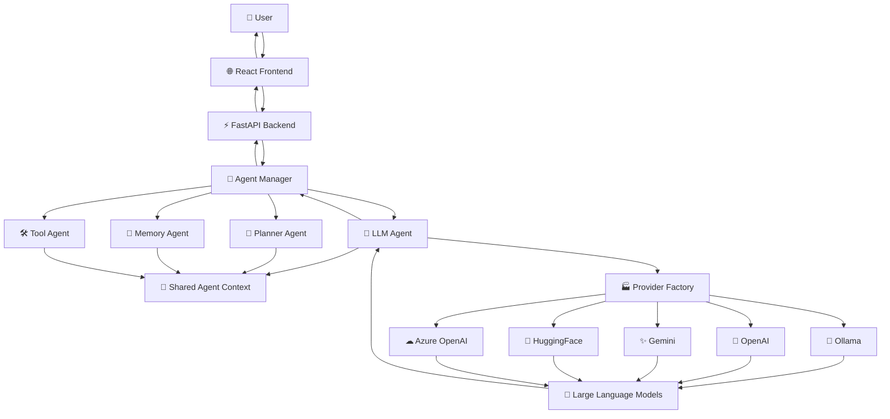
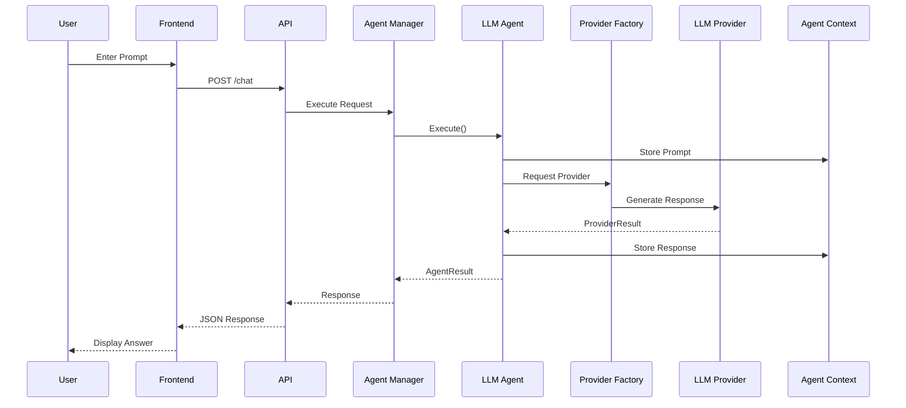
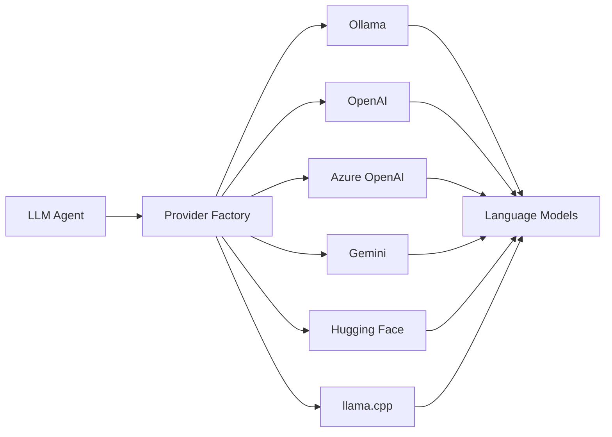

<div align="center">

# Distributed Agentic Reasoning Framework (DARF)

### A Modular Multi-Agent AI Framework for Reasoning, Planning, Memory, Tool Execution and Intelligent Decision Support

<p align="center">

[](https://www.python.org/)
[](https://fastapi.tiangolo.com/)
[](https://react.dev/)
[](https://www.typescriptlang.org/)
[](https://ollama.com/)
[](LICENSE)

</p>

**Distributed • Modular • Provider-Agnostic • Extensible • Production Ready**

---

*A next-generation framework for orchestrating intelligent AI agents through unified reasoning, planning, memory management, tool execution and pluggable Large Language Model providers.*

</div>

---
# Overview

The **Distributed Agentic Reasoning Framework (DARF)** is a modular, production-oriented framework for building intelligent AI systems using autonomous software agents. It provides a unified architecture for orchestrating reasoning, planning, memory management, tool execution, and large language model (LLM) interactions through a centralized Agent Manager.

Unlike traditional chatbot architectures, DARF adopts an **agent-centric design** in which specialized agents collaborate to solve complex tasks while sharing a common execution context. The framework is provider-independent, allowing seamless integration with multiple LLM backends including **Ollama**, **OpenAI**, **Azure OpenAI**, **Gemini**, **Hugging Face**, and other compatible providers.

Designed with extensibility, maintainability, and scalability as primary goals, DARF serves as a foundation for intelligent assistants, research systems, financial analytics platforms, enterprise automation, and multi-agent AI applications.

---

## Key Features

- 🧠 Modular multi-agent architecture
- 🤖 Pluggable LLM providers (Ollama, OpenAI, Gemini, Hugging Face, Azure OpenAI)
- ⚡ Centralized Agent Manager for orchestration
- 💬 Production-ready FastAPI backend
- 🌐 Modern React + TypeScript frontend
- 💾 Shared execution context across agents
- 🛠 Extensible tool execution framework
- 📚 Memory-aware agent interactions
- 📊 Built for financial intelligence and research workflows
- 🔄 Provider-independent inference layer
- 📦 Clean, scalable, and maintainable project structure
- 🚀 Designed for production deployment
# System Architecture

DARF follows a layered, modular architecture that separates user interaction, API services, agent orchestration, intelligent reasoning, and language model providers into independent components.


# Agent Ecosystem

DARF is built around specialized autonomous agents. Each agent is responsible for a distinct capability while collaborating through a shared execution context managed by the **Agent Manager**.

| Agent | Responsibility | Status |
|:------|:---------------|:------:|
| 🧠 **LLM Agent** | Executes prompts using configurable Large Language Model providers and returns intelligent responses. | ✅ |
| 📝 **Planner Agent** | Decomposes complex tasks into structured execution plans for downstream agents. | ✅ |
| 💾 **Memory Agent** | Stores, retrieves and manages contextual information across agent interactions. | ✅ |
| 🛠 **Tool Agent** | Interfaces with external tools, utilities and system capabilities during reasoning workflows. | ✅ |
| 🎯 **Agent Manager** | Central orchestration engine responsible for registration, execution, lifecycle management and shared context coordination. | ✅ |

---

## Agent Collaboration Workflow

```text
User Request
      │
      ▼
Agent Manager
      │
      ├─────────────┐
      │             │
      ▼             ▼
Planner       Memory
      │             │
      └──────┬──────┘
             ▼
         LLM Agent
             │
             ▼
      Provider Factory
             │
             ▼
        LLM Provider
             │
             ▼
      Generated Response
             │
             ▼
      Agent Manager
             │
             ▼
           User
```

---

## Agent Design Principles

- Modular architecture with clearly defined responsibilities.
- Shared execution context for seamless inter-agent communication.
- Stateless execution wherever possible.
- Provider-independent reasoning pipeline.
- Thread-safe execution model.
- Easily extensible through custom agent implementations.
- Production-oriented lifecycle management.
- Unified execution telemetry and metadata collection.

---
# Core Framework Components

DARF is composed of modular, reusable framework components that collectively provide orchestration, execution, context management, and provider abstraction. Each component has a clearly defined responsibility, enabling clean separation of concerns and long-term maintainability.

---

## 🧠 Agent Manager

The **Agent Manager** is the central orchestration engine responsible for coordinating every agent within the framework. It manages the complete agent lifecycle, shared execution context, execution statistics, and centralized registration.

### Responsibilities

- Register and unregister agents
- Execute agents by instance or identifier
- Maintain shared execution context
- Track execution statistics
- Provide a unified execution interface
- Coordinate inter-agent communication

---

## 💬 Agent Context

The **Agent Context** provides a shared workspace for communication between agents during execution. It allows every agent to exchange information without introducing direct dependencies.

### Responsibilities

- Store shared execution state
- Maintain conversation context
- Exchange intermediate outputs
- Enable cross-agent collaboration
- Preserve execution metadata

---

## 📋 Agent Registry

The **Agent Registry** maintains a centralized collection of all registered agents and enables dynamic discovery throughout the framework.

### Responsibilities

- Register agents
- Remove agents
- Lookup agents by identifier
- Enumerate registered agents
- Validate registrations

---

## ⚙ Base Agent

Every DARF agent inherits from the **BaseAgent**, which implements a standardized execution lifecycle using the Template Method design pattern.

### Built-in Features

- Lifecycle hooks
- Standardized execution wrapper
- Exception handling
- Performance timing
- Structured results
- Shared context integration
- Production-ready logging

---

## 🧩 Provider Factory

The **Provider Factory** abstracts the underlying language model implementation by dynamically instantiating the configured provider at runtime.

### Supported Providers

| Provider | Status |
|:----------|:------:|
| 🦙 Ollama | ✅ |
| 🤖 OpenAI | ✅ |
| ☁ Azure OpenAI | ✅ |
| ✨ Gemini | ✅ |
| 🤗 Hugging Face | ✅ |
| 🦙 llama.cpp | ✅ |

This abstraction enables seamless switching between providers without requiring changes to agent implementations.

---

## 🔄 Execution Lifecycle

```text
Request
   │
   ▼
Agent Manager
   │
   ▼
Base Agent
   │
   ▼
before_run()
   │
   ▼
run()
   │
   ▼
LLM Provider
   │
   ▼
after_run()
   │
   ▼
Agent Result
   │
   ▼
Response
```

---

## Design Principles

- Modular architecture
- Provider-independent execution
- Separation of concerns
- Centralized orchestration
- Extensible agent ecosystem
- Production-ready error handling
- Thread-safe execution model
- High maintainability
- Reusable software components
# Project Structure

DARF follows a modular, layered architecture designed for scalability, maintainability, and clear separation of concerns. Each package is responsible for a specific subsystem within the framework.

```text
Distributed-Agentic-Reasoning-Framework
│
├── agents/                 # Core autonomous agents
│   ├── agent.py
│   ├── base_agent.py
│   ├── agent_manager.py
│   ├── agent_registry.py
│   ├── agent_context.py
│   ├── agent_result.py
│   ├── llm_agent.py
│   ├── planner_agent.py
│   ├── memory_agent.py
│   └── tool_agent.py
│
├── api/                    # FastAPI backend
│   ├── app.py
│   ├── routes/
│   ├── middleware/
│   ├── models/
│   └── dependencies.py
│
├── app_core/               # DARF application bootstrap
│   └── application.py
│
├── bootstrap/              # Framework initialization
│
├── config/                 # Global configuration
│
├── frontend/               # React + TypeScript frontend
│
├── llm/                    # Provider abstraction layer
│   ├── provider.py
│   ├── provider_config.py
│   ├── provider_result.py
│   ├── factory/
│   ├── ollama_provider.py
│   ├── openai_provider.py
│   ├── gemini_provider.py
│   ├── huggingface_provider.py
│   └── azure_openai_provider.py
│
├── memory/                 # Memory subsystem
│
├── tools/                  # Tool execution framework
│
├── tests/                  # Unit & integration tests
│
├── requirements.txt
├── README.md
└── LICENSE
```

---

## Repository Organization

| Directory | Purpose |
|:-----------|:--------|
| **agents/** | Autonomous agents and orchestration components |
| **api/** | FastAPI REST services and endpoints |
| **app_core/** | Central DARF application initialization |
| **bootstrap/** | Framework startup and dependency wiring |
| **config/** | Environment and runtime configuration |
| **frontend/** | React-based web interface |
| **llm/** | Provider abstraction and implementations |
| **memory/** | Memory management and retrieval |
| **tools/** | External tool integration layer |
| **tests/** | Automated testing suite |

---

## Architectural Characteristics

DARF is organized using a layered software architecture that promotes:

- 🧩 High modularity
- 🔄 Loose coupling between components
- 📦 Independent subsystem development
- 🧠 Reusable agent implementations
- ⚡ Provider-independent language model integration
- 🚀 Production-ready deployment
- 🔍 Simplified testing and debugging
- 📈 Long-term scalability

---
# Installation & Quick Start

DARF is designed to be straightforward to set up while remaining flexible enough for research, enterprise, and production environments.

---

## System Requirements

| Component | Minimum Version |
|:----------|:---------------:|
| Python | 3.11+ |
| Node.js | 20+ |
| npm | 10+ |
| Git | Latest |
| Ollama | Latest |
| Operating System | Windows, Linux, macOS |

---

## 1. Clone the Repository

```bash
git clone https://github.com/<YOUR_USERNAME>/Distributed-Agentic-Reasoning-Framework.git

cd Distributed-Agentic-Reasoning-Framework
```

---

## 2. Create a Python Virtual Environment

### Windows

```powershell
python -m venv .venv

.\.venv\Scripts\activate
```

### Linux / macOS

```bash
python3 -m venv .venv

source .venv/bin/activate
```

---

## 3. Install Backend Dependencies

```bash
pip install --upgrade pip

pip install -r requirements.txt
```

---

## 4. Configure Environment Variables

Copy the example configuration file.

### Windows

```powershell
copy .env.example .env
```

### Linux / macOS

```bash
cp .env.example .env
```

Configure the following values inside **.env**.

```text
LLM_PROVIDER=ollama

LLM_MODEL=llama3.2

OLLAMA_BASE_URL=http://localhost:11434
```

---

## 5. Install Ollama

Download Ollama from

https://ollama.com/download

Verify the installation.

```powershell
ollama --version
```

---

## 6. Download the Language Model

```powershell
ollama pull llama3.2
```

Verify that the model is available.

```powershell
ollama list
```

Expected output:

```text
llama3.2:latest
```

---

## 7. Verify the Ollama Service

```powershell
Invoke-RestMethod http://localhost:11434/api/tags
```

If the model list is returned successfully, the local inference service is ready.

---

## 8. Start the Backend

Activate the virtual environment if it is not already active.

```powershell
.\.venv\Scripts\activate
```

Run the FastAPI application.

```powershell
uvicorn api.app:app --reload
```

Expected output:

```text
Application startup complete.
```

The backend will be available at

```
http://127.0.0.1:8000
```

Interactive API documentation:

```
http://127.0.0.1:8000/docs
```

---

## 9. Start the Frontend

Open a new terminal.

```powershell
cd frontend

npm install

npm run dev
```

The frontend will be available at

```
http://localhost:5173
```

---

## 10. Verify the Installation

Open the web interface.

```
http://localhost:5173
```

Enter a prompt such as

```text
Hello DARF
```

A successful response confirms that:

- FastAPI is operational
- Agent Manager is running
- LLM Agent is initialized
- Ollama is connected
- React frontend is communicating with the backend

---

## Quick Verification via REST API

The backend can also be tested directly.

```powershell
Invoke-RestMethod `
-Uri http://127.0.0.1:8000/chat `
-Method POST `
-ContentType "application/json" `
-Body '{"prompt":"Hello DARF"}'
```

Example response:

```json
{
    "success": true,
    "message": "OK",
    "response": "Hello! How can I assist you today?",
    "agent": "llm"
}
```

---

## Congratulations 🎉

DARF is now successfully configured and ready for intelligent multi-agent reasoning.
# Framework Workflow

DARF processes every user request through a structured, multi-stage reasoning pipeline. Each component is responsible for a specific phase of execution, enabling modularity, extensibility, and clean separation of concerns.

---

## End-to-End Execution Pipeline



---

# Request Lifecycle

Every request follows the same standardized execution lifecycle throughout the framework.

```text
User Prompt
      │
      ▼
React Frontend
      │
      ▼
FastAPI Endpoint
      │
      ▼
Dependency Injection
      │
      ▼
Agent Manager
      │
      ▼
LLM Agent
      │
      ▼
Provider Factory
      │
      ▼
Configured Provider
      │
      ▼
Language Model
      │
      ▼
Provider Result
      │
      ▼
Agent Result
      │
      ▼
JSON Response
      │
      ▼
Frontend
      │
      ▼
User
```

---

# Execution Stages

| Stage | Description |
|:------|:------------|
| **1. Request Reception** | The React frontend submits a user prompt to the FastAPI backend. |
| **2. Dependency Resolution** | FastAPI injects the shared Agent Context and the registered LLM Agent. |
| **3. Agent Execution** | The Agent Manager delegates execution to the appropriate agent. |
| **4. Context Management** | The active prompt is stored inside the shared execution context. |
| **5. Provider Selection** | The Provider Factory dynamically resolves the configured LLM provider. |
| **6. Model Inference** | The selected provider generates a response using the configured language model. |
| **7. Result Processing** | Provider results are validated, converted into framework-standard Agent Results, and stored. |
| **8. Response Delivery** | The API returns a structured JSON response to the frontend. |

---

# Design Objectives

DARF's execution pipeline was designed around several engineering principles.

- ⚡ Low coupling between framework components
- 🧩 Modular agent execution
- 🔄 Provider-independent inference
- 📦 Standardized execution lifecycle
- 💾 Shared execution context
- 📊 Structured execution results
- 🚀 Production-ready request handling
- 🔍 Simplified debugging and observability
- 🛡 Robust exception handling
- ♻ Highly extensible architecture

---

# Supported Execution Flow

```text
Input
   │
   ▼
Validation
   │
   ▼
Agent Selection
   │
   ▼
Context Update
   │
   ▼
Provider Resolution
   │
   ▼
Inference
   │
   ▼
Response Generation
   │
   ▼
Result Serialization
   │
   ▼
Client Response
```

---
# REST API Reference

DARF exposes a RESTful API built with **FastAPI**, enabling seamless integration with web applications, desktop clients, mobile applications, and third-party services.

The API follows a JSON-based request/response contract and is fully documented using the OpenAPI Specification.

---

## Interactive Documentation

Once the backend is running, the interactive API documentation is available at:

| Documentation | URL |
|:--------------|:----|
| Swagger UI | http://127.0.0.1:8000/docs |
| OpenAPI Schema | http://127.0.0.1:8000/openapi.json |

---

# Available Endpoints

| Endpoint | Method | Description |
|:----------|:------:|:------------|
| `/` | GET | Framework information |
| `/health` | GET | Health check |
| `/chat` | POST | Execute LLM conversations |
| `/agents` | GET | List registered agents |
| `/execute` | POST | Execute an agent |
| `/memory` | POST | Memory operations |
| `/tools` | POST | Tool execution |

---

# Chat Endpoint

### Request

**POST**

```
/chat
```

### Request Body

```json
{
    "prompt": "Explain Distributed Agentic Reasoning Framework.",
    "temperature": 0.7,
    "max_tokens": 4096
}
```

---

### Successful Response

```json
{
    "success": true,
    "message": "OK",
    "response": "Distributed Agentic Reasoning Framework (DARF) is ...",
    "agent": "llm",
    "metadata": {}
}
```

---

### Error Response

```json
{
    "detail": "LLM execution failed."
}
```

---

# Health Endpoint

### Request

```
GET /health
```

### Response

```json
{
    "status": "healthy",
    "version": "1.0"
}
```

---

# Root Endpoint

### Request

```
GET /
```

### Response

```json
{
    "name": "Distributed Agentic Reasoning Framework",
    "version": "1.0",
    "status": "running",
    "docs": "/docs"
}
```

---

# HTTP Status Codes

| Code | Meaning |
|:----:|:--------|
| **200** | Request completed successfully |
| **400** | Invalid request payload |
| **404** | Resource not found |
| **405** | Unsupported HTTP method |
| **422** | Request validation failed |
| **500** | Internal framework error |
| **503** | Required service unavailable |

---

# Example cURL

```bash
curl -X POST http://127.0.0.1:8000/chat \
-H "Content-Type: application/json" \
-d '{
    "prompt":"Hello DARF"
}'
```

---

# Example PowerShell

```powershell
Invoke-RestMethod `
-Uri http://127.0.0.1:8000/chat `
-Method POST `
-ContentType "application/json" `
-Body '{"prompt":"Hello DARF"}'
```

---

# Response Schema

| Field | Type | Description |
|:------|:----:|:------------|
| `success` | Boolean | Indicates whether the request completed successfully |
| `message` | String | Human-readable status message |
| `response` | String | Generated response from the selected agent |
| `agent` | String | Agent responsible for processing the request |
| `metadata` | Object | Additional execution metadata |

---

# API Characteristics

- RESTful architecture
- JSON request/response contracts
- OpenAPI compliant
- Interactive Swagger documentation
- Dependency injection via FastAPI
- Provider-independent execution
- Standardized response schema
- Production-ready error handling
- Easily extensible routing architecture

---
# Supported LLM Providers

One of DARF's core design principles is **provider independence**. Applications built on DARF are not coupled to a single Large Language Model provider. Instead, the framework dynamically resolves the configured provider through the **Provider Factory**, allowing developers to switch inference backends without modifying application logic.

---

## Supported Providers

| Provider | Status | Local/Cloud | Chat | Embeddings |
|:----------|:------:|:-----------:|:----:|:----------:|
| 🦙 Ollama | ✅ | Local | ✅ | ⚠ Partial |
| 🤖 OpenAI | ✅ | Cloud | ✅ | ✅ |
| ☁ Azure OpenAI | ✅ | Cloud | ✅ | ✅ |
| ✨ Gemini | ✅ | Cloud | ✅ | ✅ |
| 🤗 Hugging Face | ✅ | Cloud / Local | ✅ | ✅ |
| 🦙 llama.cpp | ✅ | Local | ✅ | ⚠ Optional |

---

## Provider Architecture



---

# Provider Selection

The active provider is configured through the application environment.

Example:

```text
LLM_PROVIDER=ollama

LLM_MODEL=llama3.2

OLLAMA_BASE_URL=http://localhost:11434
```

Switching to OpenAI requires only:

```text
LLM_PROVIDER=openai

LLM_MODEL=gpt-5

OPENAI_API_KEY=YOUR_API_KEY
```

No application code changes are required.

---

# Provider Factory

DARF automatically constructs the appropriate provider implementation during framework initialization.

```text
Configuration

        │

        ▼

Provider Factory

        │

        ├──────────────┐
        │              │
        ▼              ▼

 Ollama        OpenAI

        │              │

        ▼              ▼

 Language Model Provider

        │

        ▼

 LLM Agent
```

---

# Why Provider Independence Matters

DARF separates application logic from inference infrastructure, enabling organizations to adopt the provider that best fits their requirements.

### Advantages

- 🔄 Switch providers without changing application code.
- 🚀 Support both local and cloud deployments.
- 🔒 Keep sensitive workloads on-premise using local models.
- 📈 Scale seamlessly across multiple inference backends.
- 🧩 Add custom providers with minimal integration effort.
- ⚡ Future-proof applications against evolving LLM ecosystems.
- 🏢 Support enterprise, research, and production environments.

---

# Current Demonstration Configuration

The prototype included in this repository is configured with:

| Component | Value |
|:----------|:------|
| Provider | Ollama |
| Model | llama3.2 |
| Inference | Local |
| API | FastAPI |
| Frontend | React + TypeScript |
| Communication | REST API |
| Response Format | JSON |

---

# Extending DARF

Adding a new provider requires implementing the standard **LLMProvider** interface.

```text
LLMProvider (Abstract)

        │

        ├───────────── OpenAIProvider

        ├───────────── OllamaProvider

        ├───────────── GeminiProvider

        ├───────────── HuggingFaceProvider

        ├───────────── AzureOpenAIProvider

        └───────────── CustomProvider
```

This architecture ensures that every provider follows the same execution contract while remaining completely interchangeable within the framework.

---
# Live Demonstration

The following screenshots illustrate the current DARF prototype in action. The system demonstrates a complete end-to-end execution pipeline, from user interaction through the React frontend to backend inference using the Ollama-powered LLM and back to the client.

---

# Demonstration Overview

The prototype currently supports:

- Interactive chat interface
- Real-time communication between frontend and backend
- Local LLM inference through Ollama
- FastAPI REST services
- Automatic agent execution
- Shared execution context
- Structured JSON responses
- Production-style API documentation

---

# System Demonstration

## React Frontend

> **Insert Screenshot**

```
docs/images/frontend-chat.png
```

**Description**

The React frontend provides a clean conversational interface where users interact directly with the DARF framework. Messages are transmitted to the backend through REST APIs and rendered immediately upon receiving responses.

---

## FastAPI Swagger Documentation

> **Insert Screenshot**

```
docs/images/swagger-ui.png
```

**Description**

DARF automatically generates OpenAPI-compliant documentation using FastAPI. Developers can explore endpoints, execute requests interactively, and inspect request/response schemas directly from the browser.

---

## Successful API Response

> **Insert Screenshot**

```
docs/images/api-response.png
```

**Description**

A successful API request demonstrates the standardized JSON response generated by the framework, including execution status, responding agent, metadata, and generated content.

---

## Ollama Inference

> **Insert Screenshot**

```
docs/images/ollama-terminal.png
```

**Description**

The framework communicates with a locally hosted Ollama server to perform inference using the configured language model. This enables completely local execution without relying on external cloud APIs.

---

## Backend Server

> **Insert Screenshot**

```
docs/images/backend-terminal.png
```

**Description**

The FastAPI backend handles incoming requests, executes the appropriate agents, communicates with the configured provider, and returns structured responses to the client.

---

## Framework Workflow

```text
User

   │

   ▼

React Frontend

   │

   ▼

POST /chat

   │

   ▼

FastAPI

   │

   ▼

Dependency Injection

   │

   ▼

Agent Manager

   │

   ▼

LLM Agent

   │

   ▼

Provider Factory

   │

   ▼

Ollama Provider

   │

   ▼

Llama 3.2

   │

   ▼

Provider Result

   │

   ▼

Agent Result

   │

   ▼

JSON Response

   │

   ▼

Frontend Update

   │

   ▼

User
```

---

# Demonstrated Features

| Feature | Status |
|:---------|:------:|
| React Frontend | ✅ |
| FastAPI Backend | ✅ |
| REST Communication | ✅ |
| Agent Manager | ✅ |
| Dependency Injection | ✅ |
| LLM Agent | ✅ |
| Ollama Integration | ✅ |
| Local Inference | ✅ |
| JSON Responses | ✅ |
| OpenAPI Documentation | ✅ |

---

# Prototype Highlights

The current implementation demonstrates the core architecture of DARF operating as an integrated multi-agent reasoning framework.

Key capabilities include:

- End-to-end conversational workflow
- Modular agent execution
- Provider-independent architecture
- Local large language model inference
- Standardized execution lifecycle
- Production-ready API design
- Extensible framework architecture
- Clean separation of concerns
- Real-time request processing

---

# Demonstration Environment

| Component | Configuration |
|:----------|:--------------|
| Operating System | Windows 11 |
| Backend | FastAPI |
| Frontend | React + TypeScript |
| Language | Python 3.11 |
| Provider | Ollama |
| Model | llama3.2 |
| API Protocol | REST |
| Documentation | OpenAPI / Swagger |
| Runtime | Uvicorn |

---
# Roadmap

The DARF framework is under active development. Future releases will expand the reasoning capabilities, distributed execution engine, and enterprise deployment features.

## Planned Features

- Multi-agent collaborative reasoning
- Distributed agent execution
- Agent-to-agent communication
- Retrieval-Augmented Generation (RAG)
- Long-term semantic memory
- Vector database integration
- Streaming response support
- WebSocket communication
- Authentication and authorization
- Multi-modal reasoning
- Plugin architecture
- Kubernetes deployment
- Horizontal scaling
- Monitoring and observability
- Benchmarking suite

---

# Contributing

Contributions are welcome.

If you would like to contribute to DARF:

1. Fork the repository.
2. Create a feature branch.

```bash
git checkout -b feature/my-feature
```

3. Commit your changes.

```bash
git commit -m "Add new feature"
```

4. Push your branch.

```bash
git push origin feature/my-feature
```

5. Open a Pull Request.

Please ensure all code follows the project architecture and coding standards.

---

# License

This project is released under the MIT License.

See the LICENSE file for additional information.

---

# Acknowledgements

DARF builds upon the excellent work of the open-source AI community.

Special thanks to the teams behind:

- FastAPI
- React
- TypeScript
- Ollama
- Llama 3
- Hugging Face
- FAISS
- Sentence Transformers
- PyTorch
- Uvicorn

---

# Contact

**Distributed Agentic Reasoning Framework (DARF)**

For questions, feature requests, or collaboration opportunities, please open an issue in this repository.

---

<div align="center">

## Distributed Agentic Reasoning Framework

**Modular • Scalable • Provider Independent • Production Ready**

Built using Python, FastAPI, React, TypeScript, and Ollama.

</div>